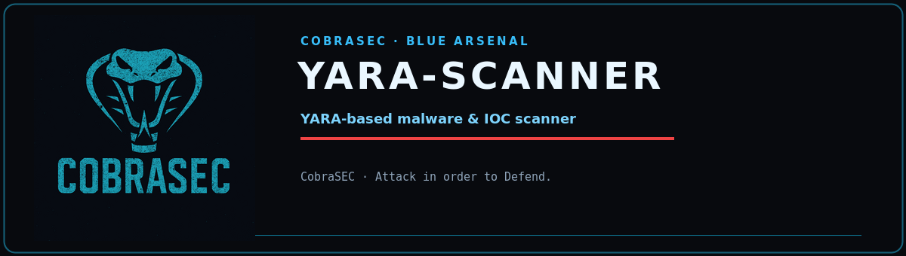

<p align="center">
  
</p>

<p align="center">
  
  
  
  
</p>

<h1 align="center">yara-scanner</h1>
<p align="center"><b>YARA-based malware scanner</b><br><sub><i>CobraSEC · Attack in order to Defend.</i></sub></p>

---


Features:
  - 40+ built-in detection rules (webshells, C2 stagers, miners, reverse shells,
    credential dumpers, keyloggers, obfuscated payloads, macro malware)
  - Scan files, directories, or whole filesystems
  - Load custom .yar/.yara rules from external directories
  - Recursive scanning with extension and size filters
  - Process memory scanning via /proc/<pid>/mem (root)
  - JSON / CSV / text report output
  - Match deduplication and severity scoring

Usage:
  python3 yara_scanner.py --scan /var/www/html          # scan web root
  python3 yara_scanner.py --scan /tmp --recursive
  python3 yara_scanner.py --scan-file /bin/ls
  python3 yara_scanner.py --scan-process 1234
  python3 yara_scanner.py --scan / --exclude /proc --exclude /sys --max-size 10M
  python3 yara_scanner.py --rules-dir /opt/rules --list-rules
  python3 yara_scanner.py --scan /var/www --output results.json

## Requirements

- Python 3.8+ (standard library only — no external dependencies)

## Usage

```
python3 yara_scanner.py --help
```

```
usage: yara_scanner.py [-h] [--scan SCAN [SCAN ...]] [--scan-file SCAN_FILE]
                       [--scan-process PID] [--recursive]
                       [--extensions EXTENSIONS] [--all-files]
                       [--max-size MAX_SIZE] [--exclude EXCLUDE]
                       [--rules-dir RULES_DIR] [--list-rules]
                       [--output OUTPUT] [--quiet]

YARA Scanner — IOC-based malware detection

options:
  -h, --help            show this help message and exit
  --scan, -s SCAN [SCAN ...]
                        File(s)/directories to scan
  --scan-file SCAN_FILE
                        Scan single file
  --scan-process PID    Scan process memory of PID
  --recursive, -r       Recursive scan
  --extensions EXTENSIONS
                        Comma-separated extensions filter (e.g. php,jsp,exe)
  --all-files           Scan all files (ignore extension filter)
  --max-size MAX_SIZE   Max file size (default 50M)
  --exclude EXCLUDE     Directory to exclude (repeatable)
  --rules-dir RULES_DIR
                        Directory containing .yar/.yara rule files
                        (repeatable)
  --list-rules          List loaded rules and exit
  --output, -o OUTPUT   Export results to JSON
  --quiet, -q           Only print matches
```

## Notes

- Defensive tooling: run only on systems you own or are authorized to assess.
- Read-only by design where possible; review flags before use on production hosts.
- Some checks (disk sectors, process memory, raw sockets) require root.
